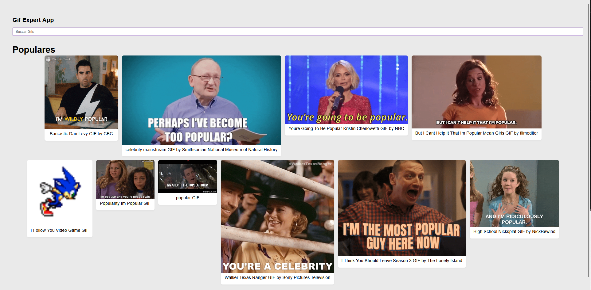
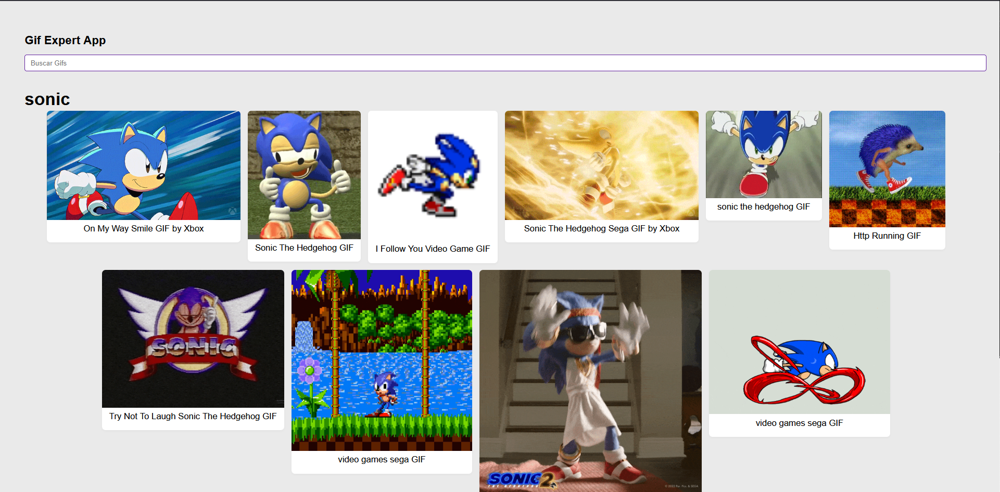
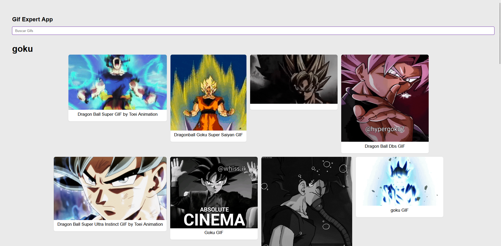

# 🎬 GifExpertApp

<div align="center">


### 🚀 Encuentra los mejores GIFs al instante

Una aplicación web moderna y rápida para buscar y descubrir GIFs animados usando la API de Giphy.

</div>

---

## 📸 Capturas de Pantalla

<div align="center">
  <p><em>Buscador de Gifs</em></p>
  
  <br><br>
  <p><em>Gifs renderizados</em></p>
  
  
</div>

---

## ✨ Características Principales

- 🔍 **Búsqueda Instantánea** - Encuentra GIFs en tiempo real mientras escribes
- ⚡ **Ultra Rápida** - Construida con Vite para un rendimiento óptimo
- 📱 **Responsive Design** - Se adapta perfectamente a cualquier dispositivo
- 🎨 **Interfaz Moderna** - Diseño limpio y atractivo
- 🔄 **Actualización Dinámica** - Los resultados se cargan sin recargar la página
- 💾 **Historial de Búsqueda** - Mantiene un registro de tus búsquedas recientes
- 🎯 **Grid Adaptativo** - Visualización óptima de los GIFs en cualquier pantalla

---

## 🛠️ Tecnologías Utilizadas

| Tecnología          | Descripción                                   |
| ------------------- | --------------------------------------------- |
| **React**           | Librería para construir interfaces de usuario |
| **Vite**            | Build tool ultra rápido para desarrollo       |
| **Giphy API**       | API para obtener GIFs animados                |
| **CSS3**            | Estilos modernos y animaciones                |
| **JavaScript ES6+** | Funcionalidades modernas de JavaScript        |

---

## 🚀 Inicio Rápido

### Prerrequisitos

Asegúrate de tener instalado:

- Node.js (v14 o superior)
- npm o yarn

### Instalación

1️⃣ **Clona el repositorio**

```bash
git clone ssh git@github.com:794613L/React_GifApp.git
cd React_GifApp
```

2️⃣ **Instala las dependencias**

```bash
npm install
# o
yarn install
```

3️⃣ **Configura tu API Key** (Opcional)

Crea un archivo `.env` en la raíz del proyecto:

```env
VITE_GIPHY_API_KEY=tu_api_key_aqui
```

4️⃣ **Inicia el servidor de desarrollo**

```bash
npm run dev
# o
yarn dev
```

5️⃣ **Abre tu navegador**

Visita `http://localhost:5173` y ¡disfruta! 🎉

---

## 📦 Scripts Disponibles

```bash
npm run dev          # Inicia el servidor de desarrollo
npm run build        # Crea el build de producción
npm run preview      # Previsualiza el build de producción
npm run lint         # Ejecuta el linter
```

---

## 🌐 Despliegue

El proyecto puede ser desplegado fácilmente en:

- **Vercel** - [Guía de despliegue](https://vercel.com)
- **Netlify** - [Guía de despliegue](https://netlify.com)
- **GitHub Pages** - [Guía de despliegue](https://pages.github.com)

---

## 📁 Estructura del Proyecto

```
React_GifApp/
├── docs/              # Archivos de despliegue (ej. GitHub Pages)
├── src/
│   ├── components/
│   │   ├── AddCategory.jsx
│   │   ├── GifGrid.jsx
│   │   └── GifItem.jsx
│   ├── helpers/
│   │   └── getGifs.js
│   ├── hooks/
│   │   └── useFetchGifs.js
│   ├── GifExpertApp.jsx
│   └── main.jsx
├── .gitignore
├── package.json
├── vite.config.js
└── README.md
```

---

<div align="center">

### ⭐ Si te gustó el proyecto, dale una estrella!

**Hecho con ❤️ y ☕**

</div>
